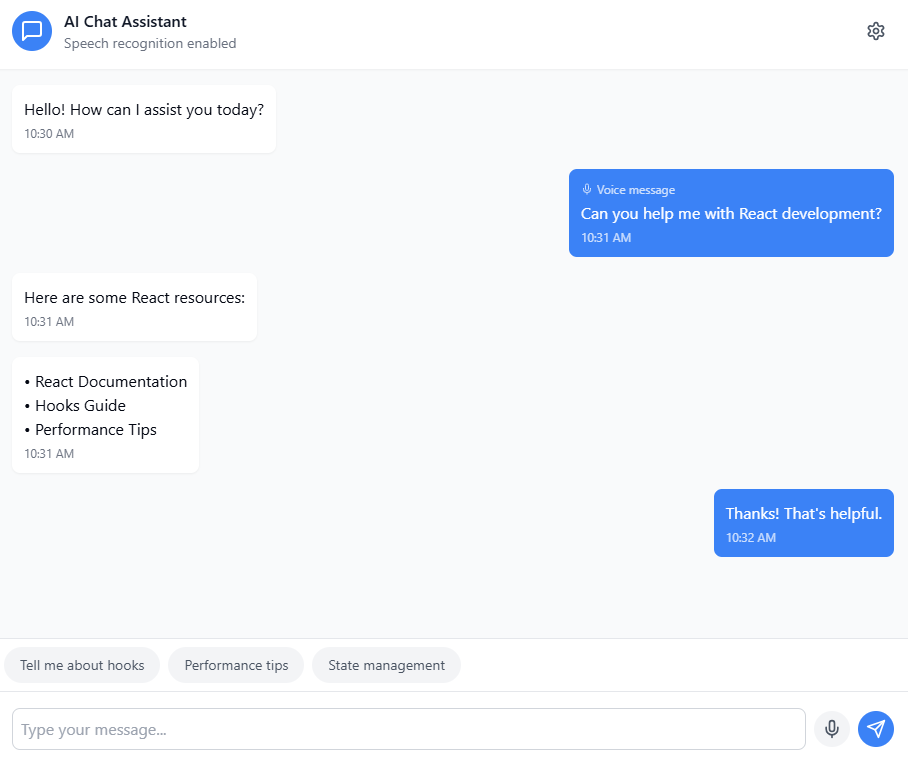

# AI Chat Interface Challenge 🚀

Welcome to our Senior React Developer technical challenge! This challenge invites you to build a modern, intelligent chat interface that showcases your expertise in React development, browser APIs, and modern frontend architecture.

## 🎯 Challenge Overview

Create a sophisticated AI chat interface that processes text and speech input, manages complex state, and provides a polished user experience. Your solution will demonstrate your ability to:

-   Implement modern React patterns
-   Integrate browser APIs
-   Design responsive interfaces
-   Manage complex application state
-   Handle real-time interactions

## 🏗️ System Components

The application consists of three main components:

-   **Chat Interface**: Modern React implementation with message threading
-   **Speech Recognition**: Browser API integration for voice input
-   **Mock Backend**: Simple API for message processing

## 💡 Core Features

### Chat Interface



-   Real-time message thread
-   Speech-to-text input support
-   Theme switching (dark/light mode)
-   Quick reply suggestions
-   Settings panel
-   Loading states and error handling

## ⏱️ Time Expectations

While you have 24 hours to submit, the challenge is designed for 2 hours of focused development time. The window allows for:

-   Core implementation
-   Documentation
-   Testing and refinement
-   Docker configuration

## 📋 Repository Structure

```
app/
├──cypress/
│   ├── e2e
│   ├── fixtures/
│   ├── screenshots/
├── src/
│   ├── components/
│   ├── hooks/
│   ├── context/
│   ├── services/
│   └── types/
├── Dockerfile
├── docker-compose.yml
└── README.md
```

## 🚀 Getting Started

1. Clone this repository
2. Review specifications.md
3. Implement your solution
4. Test and document
5. Submit your repository

## 🐳 Docker Setup

Your solution must include proper Docker configuration:

```yaml
services:
    app:
        build: .
        ports:
            - "3000:3000"
        environment:
            - NODE_ENV=production
```

## 📮 Submission Requirements

1. Public GitHub repository
2. Complete source code
3. Docker configuration
4. Comprehensive README
5. Implementation documentation

### Required Documentation

1. Setup instructions
2. Architecture overview
3. Implementation decisions
4. Testing approach

## 🎯 Evaluation Criteria

### Technical Excellence (40%)

-   Code quality and organization
-   React patterns implementation
-   Performance optimization
-   Error handling
-   Testing approach

### Feature Implementation (30%)

-   Chat interface functionality
-   Speech recognition integration
-   State management
-   Theme implementation
-   Responsive design

### Best Practices (30%)

-   Documentation quality
-   Git practices
-   Docker configuration
-   Code organization
-   Development setup

## 🎯 Success Criteria

Your solution should demonstrate:

-   Clean, maintainable React code
-   Modern component architecture
-   Thoughtful state management
-   Professional documentation
-   Smooth user experience

## 🚀 Running Your Solution

```bash
# Clone repository
git clone [your-repository-url]

# Navigate to project
cd [project-directory]

# Start with Docker
docker-compose up

# Access application
open http://localhost:3000
```

## 🤝 Questions?

For any clarifications, feel free to reach out via LinkedIn.

Ready to showcase your React expertise? Let's see what you can build! 🚀
